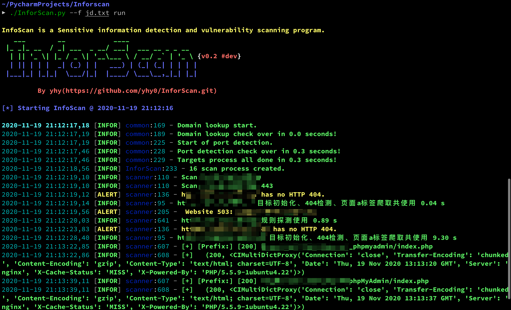

# InforScan
一款src捡洞扫描器

## 正在做

在以lijiejie大佬的[BBScan](https://github.com/lijiejie/BBScan.git)项目学习，写一个自己的扫描器（现阶段就是在照抄）。水平有限，写了一段时间了，再加上改用了python3的协程，第一次接触，好多都不会，一堆问题，有时想想用大佬的不就好了，造什么轮子，但是不能当咸鱼啊，咸鱼久了就真是咸的不能再咸了。

经过一段时间摸打滚爬，虽然还有很多问题，但是

它可以**运行**了，跑起来了，等我解决Bug，就可以愉快的捡洞了

界面从 [oneforall](https://github.com/shmilylty/OneForAll.git) 拿的，也用到了 fire 这个框架，挺好用，  内核现在还是[BBScan](https://github.com/lijiejie/BBScan.git)为主，

最近又看到一个项目[Packer-Fuzzer](https://github.com/rtcatc/Packer-Fuzzer)，觉得挺好，等我解决完Bug，考虑把其中的一些功能copy进来,,嘿嘿。

## 未完，待续 ，敬请期待。。。

Bug还没改完，就先不献丑了。