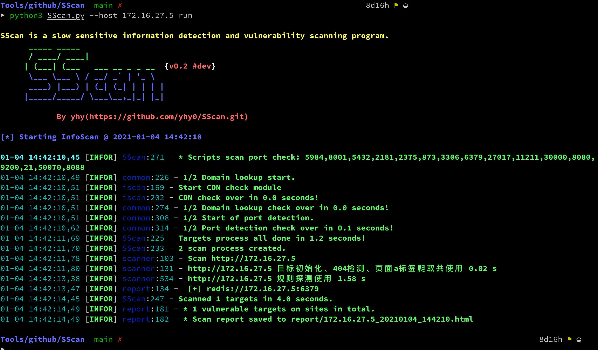

## SScan

一款src捡洞扫描器，在以lijiejie大佬的[BBScan](https://github.com/lijiejie/BBScan.git)项目学习，写一个自己的扫描器（现阶段就是在模仿）

界面从 [oneforall](https://github.com/shmilylty/OneForAll.git) 拿的，  内核现在还是[BBScan](https://github.com/lijiejie/BBScan.git)为主，目前在运行速度上和BBScan 相比有一定的差距。

## 使用

<<<<<<< HEAD
        python3 SScan.py --help				 		    获取帮助
        python3 SScan.py version		 			    查看版本
        python3 SScan.py --host example.com run		    单个目标
        python3 SScan.py --f domains.txt run		    多个目标
        python3 SScan.py --f domains.txt  --network 24 run  设置一个子网掩码(8 ~ 31)，配合	
        										上面3个参数中任意一个。将扫描Target/MASK 网络下面的所有IP
=======
        python3 SScan.py --help				 	获取帮助
        python3 SScan.py version		 		查看版本
        python3 SScan.py --host example.com run		        单个目标
        python3 SScan.py --f domains.txt run		        多个目标
        python3 SScan.py --f domains.txt  --network 24 run	设置一个子网掩码(8 ~ 31)，配合							
                                                                上面3个参数中任意一个。将扫描Target/MASK 网络下面的所有IP
>>>>>>> e7877f5f97ae329a6f2f3a52a690978961c0a3ab
## 功能

目前比[BBScan](https://github.com/lijiejie/BBScan.git) 多了一个CDN检测，默认是当检测到url解析存在cdn时，不会将ip加入扫描目标中，只扫描url

其他多了一些脚本扫描

## 脚本

目前支持：

redis、Hadoop、Hadoop yarn、docker、docker registry api、CouchDB、ftp、zookeeper、elasticsearch、memcached、mongodb、rsync、jenkins、jboss的未授权访问，mysql空口令、PostgreSQL 空口令

 参考 
 - https://github.com/test502git/Scanunauthorized/blob/master/Scanunauthorized.py
 - https://github.com/timwhitez/Frog-Auth/blob/main/pocs/pocs.py

## 数据库口令检测
目前只是检测是否存在空口令检测，后续会考虑要不要加入一些弱口令，进行检测
像这样 https://github.com/se55i0n/DBScanner/blob/master/lib/exploit.py

## 后续计划

- [ ] 将[Packer-Fuzzer](https://github.com/rtcatc/Packer-Fuzzer)项目中的一些功能集成进去，能够对js文件中的敏感信息、API进行测试
- [ ] 加入403 绕过 [BurpSuite_403Bypasser](https://github.com/sting8k/BurpSuite_403Bypasser)

## 免责声明

本工具仅能在取得足够合法授权的企业安全建设中使用，在使用本工具过程中，您应确保自己所有行为符合当地的法律法规。 
如您在使用本工具的过程中存在任何非法行为，您将自行承担所有后果，本工具所有开发者和所有贡献者不承担任何法律及连带责任。
除非您已充分阅读、完全理解并接受本协议所有条款，否则，请您不要安装并使用本工具。
您的使用行为或者您以其他任何明示或者默示方式表示接受本协议的，即视为您已阅读并同意本协议的约束。

## Star趋势

      
